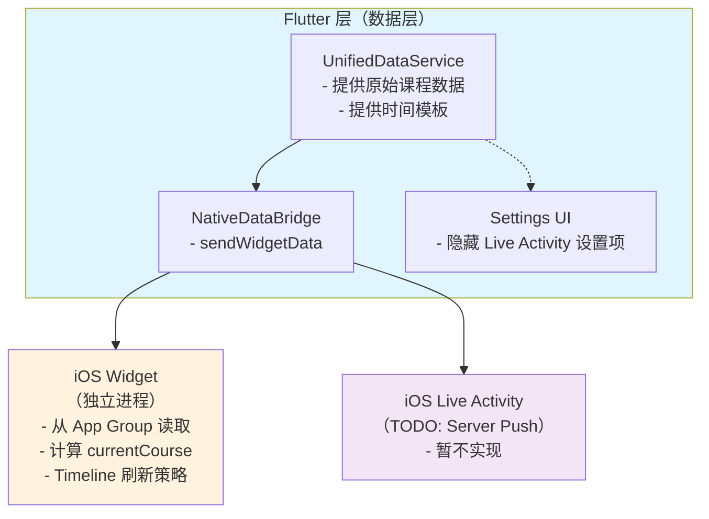

# Widget 与 Live Activity 架构重构方案 (v1.1)

## 1. 背景与问题分析

### 1.1 当前架构问题

#### Widget 层问题
- **数据过时**：Flutter 预计算 `currentCourse`/`nextCourse`，Widget Timeline 刷新时数据已过期。这是由于 Widget 的渲染时间完全由 iOS 系统决定，与 Flutter 发送数据的时间点不一致。
- **计算逻辑分散**：Flutter 和 iOS 两端都有时间计算逻辑，易不一致。
- **Timeline 策略复杂**：预生成未来状态，但数据基于发送时刻的快照。

#### Live Activity 层问题
- **TODO (暂缓实现)**：后续版本将考虑采用 Server Push 方案。
- **触发机制错误**：依赖 Widget Timeline 刷新创建，不可靠。iOS 限制后台启动 Live Activity。
- **数据模型设计错误**：`ContentState` 包含过多静态数据。
- **iOS 限制未处理**：iOS 不支持本地 schedule Live Activity。

### 1.2 根本原因
当前架构试图让 Flutter 控制一切，但 Widget 和 Live Activity 有截然不同的生命周期：
- **Widget**：系统控制刷新时机，应用无法干预。需要 Widget 拥有独立的状态计算能力。
- **Live Activity**：应用主动控制 (暂缓，计划转为服务端推送)。

## 2. 重构目标

1. **Widget 独立化**：作为"微应用"独立运行，只接收原始课表数据，运行时根据 `Date()` 自己计算显示状态。
2. **Live Activity 暂缓**：标记相关代码为 TODO，从 UI 中隐藏 Live Activity 相关设置项，等待服务端推送方案就绪。
3. **数据统一**：Flutter 只提供原始数据，不预计算状态。
4. **跨平台逻辑一致性**：确保 iOS (Swift) 和 Flutter (Dart) 使用完全相同的 Course Period 判定逻辑。

## 3. 架构设计

### 3.1 整体架构





### 3.2 关键变更点：Timeline 刷新策略

**重构前**：Flutter 每隔一段时间发送一次数据，Widget 被动展示。
**重构后**：Widget 收到数据后，`Provider` 生成 Timeline。
- **Timeline Entries**：
  1.  `Current Date` (立即更新)
  2.  `Next Course Start` (下一节课开始时刷新)
  3.  `Next Course End` (下一节课结束时刷新)
- **注意**：不要生成每分钟的 entry。只在状态改变的关键时间点（上课、下课）插入 entry。

## 4. 详细修改方案

### 4.1 数据模型修改

#### 4.1.1 WidgetScheduleData（删除预计算字段）

```dart
class WidgetScheduleData {
  final String version = '2.0';  // 版本升级，用于处理兼容性
  final DateTime timestamp;
  final String schoolId;
  final String schoolName;
  final SchoolTimeTemplate timeTemplate;  // 必须包含详细的时间段定义
  final int currentWeek;
  final int currentWeekDay;
  final String semesterName;
  
  // 原始课程数据（排序后）
  final List<WidgetCourse> todayCourses;
  final List<WidgetCourse> tomorrowCourses;
  
  // 配置
  final int approachingMinutes;
  final int tomorrowPreviewHour;
  
  // ❌ 已删除：nextCourse, currentCourse, todayCourseCount
  
  // JSON 结构需同步更新
}
```

#### 4.1.2 LiveActivityData（TODO: 精简动态数据）

```dart
/* TODO: Live Activity 暂缓实现，等待服务器推送方案
class LiveActivityData {
  // 静态展示数据
  final String courseId;
  final String courseName;
  final String? classroom;
  final String? teacher;
  final DateTime startTime;
  final DateTime endTime;
  
  // 动态状态（仅用于初始状态，后续由 Activity 内部 Timer 更新）
  final int secondsRemaining;
  final String status; // 'upcoming' | 'startingSoon'
}
*/
```

### 4.2 Flutter 层修改

#### 4.2.1 UnifiedDataService

- **移除** `_findNextCourse` 等状态计算逻辑。
- **保留** 对 `todayCourses` 和 `tomorrowCourses` 的筛选和排序。
- **TODO**: `getCurrentLiveActivityData()`：暂不实现，保留接口占位或注释掉。

#### 4.2.2 Settings UI 修改

- **TODO**: 在 `lib/Pages/Settings/WidgetSettingsView.dart` 中隐藏 Live Activity 相关的 `SettingsTile` 或 `SwitchListTile`。

#### 4.2.3 NativeDataBridge

- **TODO**: 新增 `startOrUpdateLiveActivity` MethodChannel 调用。
- **TODO**: 新增 `scheduleLocalNotification` MethodChannel 调用。

### 4.3 iOS Widget 层修改 (Swift)

#### 4.3.1 ScheduleEntry (计算属性)

```swift
struct ScheduleEntry: TimelineEntry {
    let date: Date
    let timeTemplate: SchoolTimeTemplate
    // ... 原始数据 ...
    
    // 实时计算属性
    var currentCourse: WidgetCourse? {
        // 遍历 todayCourses
        // 使用 timeTemplate 将 period 转换为具体时间范围
        // 判断 date 是否在范围内
    }
    
    var displayState: WidgetDisplayState {
        // 根据 currentCourse 和 nextCourse 及其时间差确定
        // 如：inClass, betweenClasses, approaching
    }
}
```

#### 4.3.2 Provider (Timeline 生成)

```swift
func getTimeline(in context: Context, completion: @escaping (Timeline<Entry>) -> Void) {
    let data = loadData()
    var entries: [ScheduleEntry] = []
    
    // 1. 当前时刻
    entries.append(createEntry(at: Date(), data: data))
    
    // 2. 遍历接下来的课程，添加关键时间点
    for course in data.todayCourses {
        let startTime = ... // 计算开始时间
        let endTime = ... // 计算结束时间
        
        if startTime > Date() {
            entries.append(createEntry(at: startTime, data: data))
        }
        if endTime > Date() {
            entries.append(createEntry(at: endTime, data: data))
        }
    }
    
    // 3. 设置 ReloadPolicy 为 .atEnd 或特定时间
    completion(Timeline(entries: entries, policy: .atEnd))
}
```TODO: Server Push)

- **LiveActivityManager**: TODO (暂缓实现)。
- **Updates**: 计划使用 APNs (Apple Push Notification service) 进行 Token 更新。
- **Fallback**: TODO
- **Updates**: 使用 iOS 推送或本地 `Timer` 更新倒计时（iOS 16.2+ 支持动态 Activity 更新）。
- **Fallback**: 如果无法创建 Live Activity (如后台刷新)，调用 UNUserNotificationCenter 发送本地通知。

## 5. 迁移与兼容性

1.  **数据版本检查**：iOS 端读取 `WidgetScheduleData` 时检查 `version`。
2.  **Fallback**：如果遇到旧版本数据（version 1.0 或无 version），触发一次 `WidgetCenter.shared.reloadAllTimelines()` 并尝试请求 Flutter 刷新数据，或者显示默认空状态提示用户打开 App。

---
**文档版本**：1.1 (Revised)
**更新时间**：2025-02-01
